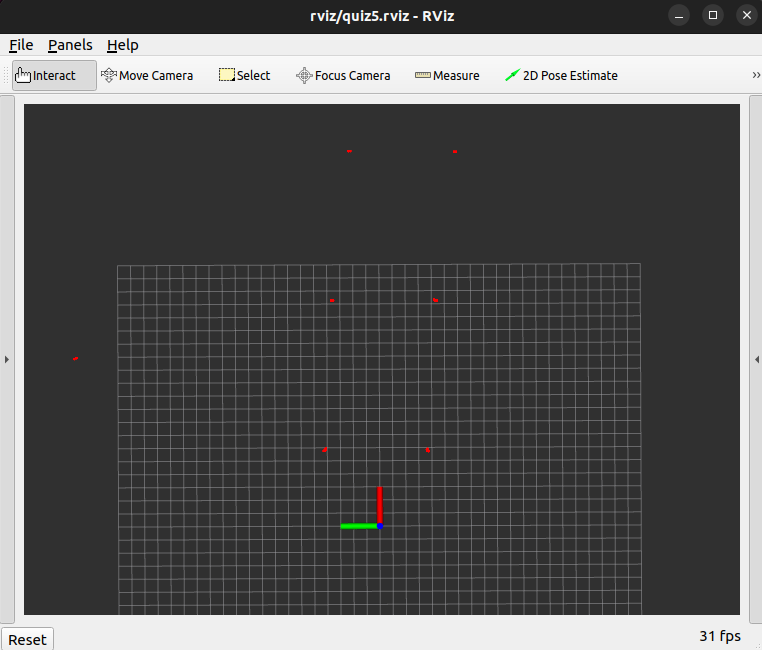

Quiz 5
======

General Information
------
There is only one part of quiz5 folder A1 and it contains all 5 tasks (there is no folder A2).  

For TASKS 1-3 you have been provided Unit Tests, for TASK 5 you execute the test on command line separately. TASK 4 test is withheld for marking after submission.

I would also advice to enable the `colcon_cd` function, which allows to rapidly change to packages, you only need to do this once.

```bash
echo "source /usr/share/colcon_cd/function/colcon_cd.sh" >> ~/.bashrc
source ~/.bashrc
```

To develop the quiz  symbolically link the [quiz5 folder](.) to your ros2_ws/src. For everyone this will be different as your repository is different.

If your quiz5 folder path is `~/git/pfms-2024a-buzz/quizzes/quiz5/`execute:

```bash
cd ~/ros2_ws/src
ln -s ~/git/pfms-2024a-buzz/quizzes/quiz5/
```
You can neither compile, nor run unit tests directly via Visual Studio code, you need to undertake both of these processes via terminal. To compile code you need to be in the `~/ros2_ws` folder and then can execute `colcon build --symlink-install --packages-select quiz5` .  To run unit tests for tasks 1-4 execute `colcon test --event-handlers console_cohesion+ --packages-select quiz5` . Task 5 has a separate testing.

So the instructions are:

```bash
cd ~/ros2_ws
colcon build --symlink-install --packages-select quiz5
colcon test --event-handlers console_cohesion+ --packages-select quiz5
```

## Unit Testing in ROS

In ROS we should unit test our libraries decoupled from publishers/subscribers, know as Level 1 testing. 

To do this we can supply a bag (a collection of data) that we have recorded and know "ground truth". Our unit tests will open this bag and test the functions (refer to `test/utest.cpp` file for how this is achieved). If you want to inspect/visualize the ROS bag supplied for quiz5  open a terminal and go to the package folder using `colcon_cd quiz5` (this should have taken you to `~/ros2_ws/src/quiz5/a1` folder, if you don't have `colcon_cd` working you can `cd` to the folder). Play the bag from this folder using `ros2 bag play -r 0.1 -l sample.bag` . The syntax `-r 0.1` replays the data at `0.1` of the full speed, `-l` loops indefinitely, until you `CTRL+C` to terminate this. 

To view the data open a terminal and go to the package folder using `colcon_cd quiz5` (this should have taken you to `~/ros2_ws/src/quiz5/a1` folder) after playing use `rviz2 -d rviz/quiz5.rviz`. The vehicle will not appear, but you will have the coordinate system of the vehicle shown as an axis. The laser readings are in red. You can see these clumped dots, which are actually cones. In below figure we have 7 cones (6 are directly in front of the vehicle).

 



If you are looking at the data in rviz, in a terminal type `ros2 topic echo /clicked_point `. Then in rviz select the **Publish Point** tool and click on any of the laser points. You will see the output in terminal similar to below. which is the value of the point clicked on, in the reference frame of the laser.

```
header:
  stamp:
    sec: 1714654182
    nanosec: 641331799
  frame_id: orange/front_laser_link
point:
  x: 13.2736234664917
  y: -4.433747291564941
  z: -0.563690185546875
```


Unit Tests TASKS 1-4
------

The task is to process laser data and extract useful information about the environments around us, RVIZ displays them in red.

For TASKS 1-4 All of your programming will be in the [LaserProcessing Class](./a1/src/laserprocessing.h). An object of this class is called from `Detection` class, but we can also use unit tests to tests it independently by providing data for which we know the "ground truth", the exact output we are expecting.  

Again, to emphasise, you can not compile or run tests in vscode. To compile your unit tests `colcon build --symlink-install --packages-select quiz5 tests`  (this command ONLY works from within `ros2_ws` folder). To run your your unit tests `colcon test --event-handlers console_cohesion+ --packages-select quiz5`

**TASK 1 - Count Returns**

Count number of laser readings that belong to obstacles, these readings in a laser scan are not infinity, nan or at max range, all other readings are from an obstacles.

As a reminder `ros2 interface show sensor_msgs/msg/LaserScan` will show you the `LaserScan` message, you will note that ranges and intensities are vectors and for each range you have the corresponding intensity at same location in the corresponding vector. Refer `week 10` for examples of working with LaserScan data.

**TASK 2 - Count Segments**

Segments are formed by consecutive laser readings that are close. To simplify things we can use a rule that successive points are less than 0.3m apart from each other (the Euclidian distance between successive points <0.3 ). The example image above has 7 segments, which belong to 7 cones.

**TASK 3 - Detect Closest Cone**

The position should be the location of the closest cone, we can leverage the segments that we computed in TASK 3. Each of those segments is a number of readings that belong to one cone. Use the mean of the points to compute the location of the cone.

**TASK 4 - Detect Road Centre**

Detect two cones, that are closest together, and on either side of the road, the road is ~8m wide. The road centre is the in the middle of the two cones which are either side of road.  


## TASK 5

We need to modify the code by adding a service node. Services are two way communication mechanisms, when [nodes](https://docs.ros.org/en/foxy/Tutorials/Beginner-CLI-Tools/Understanding-ROS2-Nodes/Understanding-ROS2-Nodes.html) communicate using [services](https://docs.ros.org/en/foxy/Tutorials/Beginner-CLI-Tools/Understanding-ROS2-Services/Understanding-ROS2-Services.html), the node that sends a request for data is called the client node, and  the one that responds to the request is the service node. [Refer to ROS guide for writing services in c++](https://docs.ros.org/en/foxy/Tutorials/Beginner-Client-Libraries/Writing-A-Simple-Cpp-Service-And-Client.html).

We have selected the `std_srvs` package and the `Trigger` service name.

Use `ros2 interface show /std_srvs/srv/Trigger`  to examine this service type. 

This means we now need to let our package `quiz5` know we need the `std_srvs` package as a dependency. Then we need to create a service object, tie it to a service name and have a callback function. 

For this exercise, we will not complete anything sophisticated. In callback function you need to augment the field so the Response to the service call changes values - as described below in full steps. 

**Steps**

[package.xml](./a1/package.xml) 

- [ ] Add the `std_srvs` package as both `build_depend` and `exec_depend`

[CMakeLists.txt](./a1/CMakeLists.txt) 

- [ ] Add a  `find_package` for `std_srvs`. 
- [ ] As our executable `sample` needs to use the `std_srvs` package/library we need to add to the existing `ament_target_dependencies` of `sample` executable, we need to add the `std_srvs` library.

[detection_node.h](./a1/src/detection_node.h) 

- [ ] Include the Trigger message

  `Syntax: #include "package_name/srv/service_name.hpp"`

- [ ] Create a service object

  `Syntax: rclcpp::Service<service_type>::SharedPtr variable_name_;`

- [ ] Change the `detect` function so it can be a callback for the service

​	` Syntax: void function_name(const std::shared_ptr<service_type::Request>  req,std::shared_ptr<service_type::Response> res);`

[detection_node.cpp](./a1/src/detection_node.cpp) 

- [ ] Create a service object of service type `std_srvs/srv/Trigger` on service name `detect_road_centre` with function name `detect` as callback.
- [ ] Change the `detect` function so it matches the header
- [ ] Change the Response fields `success` which is a boolean to be `true` and `message` which is a string should be `Road centre detected`

**Testing**

In a terminal run your node `ros2 run quiz5 sample`  and in another terminal `ros2 service call /detect_road_centre std_srvs/srv/Trigger {}`

If you have completed all steps you will see  response in the terminal that has made the service call which indicated you have passed this test.

```
waiting for service to become available...
requester: making request: std_srvs.srv.Trigger_Request()

response:
std_srvs.srv.Trigger_Response(success=True, message='Road centre detected')
```

