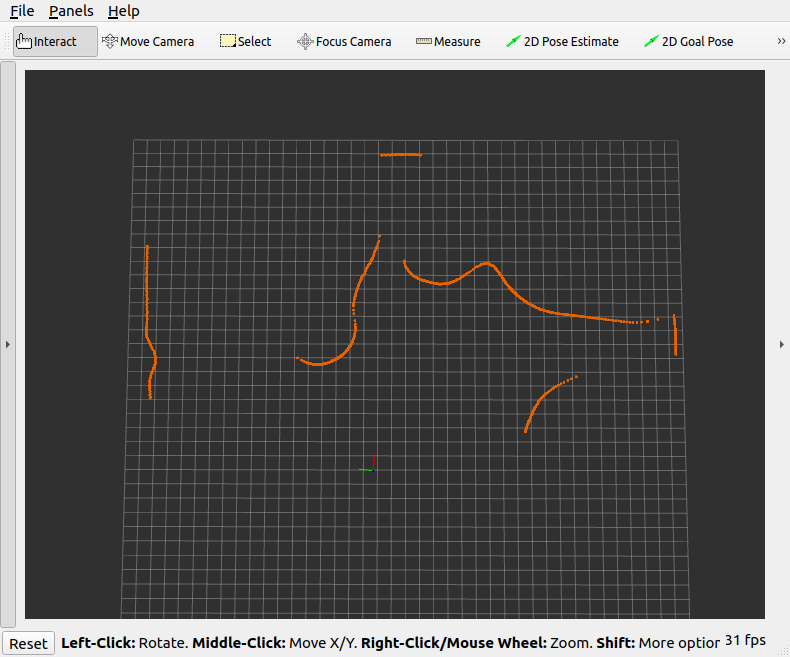

Week 12 Tutorial Questions
=========================

Work through these questions and make sure you understand what is going on in each example. 
If you have any questions about the material, please raise them in the next lab session.

This week's lab questions will make use of your `a3_skeleton` package provided to assist you with assignment 3 and well as material from week 12 which includes a `a3_support` package showcasing `ros parameters` and has GOALS you can use for your A3 testing.

* Working with ROS bags and Unit Testing
* ROS parameters and Visualisation

## ROS Bag and Unit Testing

For this task we will be working towards your A3 submission and therefore you can use your current A3 or make a copy of the `a3_skeleton` folder in scratch for this task. If your doing the latter (making a copy), you can call this copy it anything else `a3_submission` for instance. You need to link this folder to the `ros2_ws/src` folder in order for us to work on it. After you have linked it to the `ros2_ws/serc` folder you can open this folder in vscode. You  need to change the package name in `package.xml` and `CMakeLists.txt`, I would advise to change it to the folder name.

You can attempt to build the package `colcon build --symlink-install --packages-select a3_submission` The lat parameter being your package name.

We will show a two step process, recording the bag /observing the ground and adding it to a unit test. 

We have selected for this demo the Ackerman laser data and look at detecting either the number of segments or the closest point for instance.

 In order to record topic we need to have the simulator working, let's use  project 3 from A3:

```bash
ros2 launch gazebo_tf a3_project3.launch.py
```

We need some "ground truth", being that we need to record data for our unit test, ideally this is to be 

Once the launch file is running we can in this instance remove laser data from Quadcopter (Panels/Displays and Panels/Tools) will enable a view in `rviz2` as below.


You can in another terminal run `ros2 topic echo /goal_pose` which will show you the outocme of interacting with the **2D Goal Pose** tool in RVIZ.

We can count the **number of segments** here to be 7, and we can also use the **2D Goal Pose** tool  and click on the top down view with Audi on any location and also swing around that point while holding the mouse to have an orientation (not necessarily required for any of the proejcets).  The output of this clicking and the release will show the point in terminal such as

```
header:
  stamp:
    sec: 1715347100
    nanosec: 302426412
  frame_id: world
pose:
  position:
    x: 3.8024001121520996
    y: 3.645364284515381
    z: 0.0
  orientation:
    x: 0.0
    y: 0.0
    z: -0.6661770373657229
    w: 0.7457936409534667
```

This was me clicking on the closest laser point to the Audi. For your information and consideration, the position reported is in world coordinates. You need to use the Audi pose and the laser data to obtain this position.

To record a set of predefined topics, one can specify them on the command line explicitly.

```
ros2 bag record <topic1> <topic2> … <topicN> -o <folder_name>
```

The topics we need to record contain messages that are relevant to our unit test as well as transform `tf` and `tf_static` so for our example the syntax is and the switch `-o` allows us to specify a folder where data is recorded. 

Now let us record data that we can use for the unit test. The best option to prepare data for unit testing it to record it in several sub-folders within the `data` directory. For unit tests we will need to distribute the data for the unit test is run.

So wither use `colcon_cd a3_submission` or  can simply `cd ~/ros2_ws/src/a3_submission/data`

From here (from this folder) we can record a bag, which is recorded into a folder. We only need one message for our unit test, though there is no current mechanism to stop recording simply after one message is received. Therefore start recording and be prepared to stop very quickly. We use below command which has all the topics of interest and we specify data to be stored in `position2` folder (a name I've arbitrarily selected). If we do not provide a folder name it is a random name generated `ros2_XXXXXXX` and the folder name is embedded inside the data which means we can not simply rename the folder subsequently. 

```bash
ros2 bag record /orange/laserscan /orange/odom /tf /tf_static -o position2
```

Stop the recording as soon as your see 

```bash
[rosbag2_recorder]: All requested topics are subscribed. Stopping discovery...
```

This indicates the bag has all the data, we only need one message, hit `CTRL+C `immediately and it will stop recording. You can review contents via `ros2 bag info position2`, (the folder name depends on the folder name supplied initially). On my attempt I'm shown 

```bash
Files:             position2_0.db3
Bag size:          723.8 KiB
Storage id:        sqlite3
Duration:          2.976s
Start:             May 10 2024 23:33:01.244 (1715347981.244)
End:               May 10 2024 23:33:04.220 (1715347984.220)
Messages:          842
Topic information: Topic: /orange/laserscan | Type: sensor_msgs/msg/LaserScan | Count: 65 | Serialization Format: cdr
                   Topic: /tf | Type: tf2_msgs/msg/TFMessage | Count: 671 | Serialization Format: cdr
                   Topic: /orange/odom | Type: nav_msgs/msg/Odometry | Count: 104 | Serialization Format: cdr
                   Topic: /tf_static | Type: tf2_msgs/msg/TFMessage | Count: 2 | Serialization Format: cdr
```

Key is here we have messages for all topics, and the data is under 1MB. You should aim to keep data small as it is embedded in your code.

If you terminate the launch file, you can play the bag using `ros2 bag play -r 0.1 -l  position2` (this replays it `-r` at `0.1` of original speed in a loop `-l` ) and 

Just to reiterate all of the commands `ros2 bag record` `ros2 bag info` `ros2 bag play` above in instructions are executed in the terminal from the `data` folder inside your `a3_submission` package.

You can visualise the bag by running `rviz2`in another terminal and then in the menu under `Files/Recent Configs` finding one called `a2.rviz ` which enables us to see the data again. You can also undertake the counting and recording of a pose now again. And in some cases. when the platform might be moving a bit, this is actually better than recording after measuring the "ground truth". Especially if  the platform moves.



Now to insert this data and ground truth in your unit test you need to modify/create a new test (refer `test/utest.cpp`) folder in your package.

In the existing unit test `CountReturns` you will find

```c++
    std::string package_share_directory = ament_index_cpp::get_package_share_directory("a3_skeleton");//If you chnage package name you need to change this
    std::string bag_filename=package_share_directory + "/data/position1"; // The data for the bag are in the data folder and each folder (such as position1) has a bag file
```

Here the package being looked up is `a3_skeleton` and needs to change to your package name. Also the folder being used is `position1`, you can change which folder is being used for the unit test, replacing it with `position2` if that is what you have used.

Also, in the unit test we are comparing against a ground truth we obtained. You will see a lines ` EXPECT_EQ(readings,640);` which compare the result of `unsigned int readings = laserProcessing.countObjectReadings();` with `640` that we obtained independently .

Well, if you had an algorithm that counted segments, and you know there were 7 this part would be

```c++
unsigned int segments = laserProcessing.countSegments();
EXPECT_EQ(segments,7);
```

And you could also use the x,y we captured if that was being determine by your algorithm `x: 3.8` and ` y: 3.6` for instance.

Try to move Ackerman using `a1_snippets` `command_ugv` or moving it via the gazebo clinet (enabled via `ros2 launch gazebo_tf a3_project3.launch.py gui:=true`). Stop the platform and then complete following.

- [ ] Record a ROS bag with the car stationary
- [ ] Obtaining ground truth of closest point (via **2D Goal Pose** tool) and determining number of segments
- [ ] Replaying the bag back, visualising it rviz and taking another look at the data.
- [ ] Creating another unit test
- [ ] Answer: where is the ros bag going to be deposited on your system after you compile the code?

## ROS parameters, Visualisation

You have been supplied a `a3_support` package that has two nodes. Symbolically link this package to your `ros2_ws/src` folder. You should know the syntax of the command thus far (the `ln -s` syntax) we have done this in week 10,11, quiz4 and quiz5 thus far,

### ROS parameters

The `goal_publisher` node loads goals from a file supplied and publishes them on two topics. Here we introduce [ros parameters](https://docs.ros.org/en/foxy/Tutorials/Beginner-CLI-Tools/Understanding-ROS2-Parameters/Understanding-ROS2-Parameters.html) and also looks at visualisation messages. This package and node contain GOALS that can be used for testing your algorithms towards Assignment 3. 

If we decompose the `goals_publisher` we can see that it looks at obtaining parameters that are passed on command line (or saved on the system). Specifically:

```c++
auto param_desc = rcl_interfaces::msg::ParameterDescriptor{};
param_desc.description = "Filename to load goals";
node->declare_parameter("filename", default_filename, param_desc);
std::string filename = node->get_parameter("filename").as_string();
RCLCPP_INFO_STREAM(node->get_logger(),"file name with goals to be saved:" << filename);
```

The line `node->declare_parameter("filename", default_filename, param_desc);` tries to find `filename` being passed to this node and saves it to `param_desc` where `default_filename` is used if a parameter is not provided.  In our code we thereafter open the filename and read information about goals. Equally we can pass other values that could alter behaviour of the node.

If we run `ros2 run a3_support goals_publisher` it will publish `GOALS.TXT` which are the default goals in the data directory. However if we wish to publish different set of goals we can supply them on command line such as:

```bash
ros2 run a3_support goals_publisher --ros-args -p filename:=/home/student/ros2_ws/install/a3_support/share/a3_support/data/ACKERMAN.TXT
```

The path here is related to my system (where /home/student is my home directory). Run any of the launch files for a3 and: 

- [ ] supply the QUADCOPTER.TXT goals in the above folder
- [ ] view what rviz is showing and indicate how many goa,s are diplayed
- [ ] display in terminal the goals, which are published as a `PoseArray` on another topic (use the ROS CLI)

### Visualisation

Let's have a look at the visualisation aspects, where we use visualisation_msgs. In the `goal_publisher` we sent the goals to rviz via the visualisation_msgs by assembling an Array of Markers. The syntax is

```c++
visualization_msgs::msg::Marker marker;

// We need to set the frame, usually using world
marker.header.frame_id = "world";
// Here we assign the current time
marker.header.stamp = stamp;

//We set lifetime (it will dissapear in this many seconds)
marker.lifetime = rclcpp::Duration(1000,0); //zero is forever

// Set the namespace and id for this marker.  This serves to create a unique ID
// Any marker sent with the same namespace and id will overwrite the old one
marker.ns = "goals"; //This is namespace, markers can be in diofferent namespace
// We need to keep incrementing markers to send others ... 
marker.id = ct++; 

// The marker type
marker.type = visualization_msgs::msg::Marker::CUBE;

// Set the marker action.  Options are ADD and DELETE (we ADD it to the screen)
marker.action = visualization_msgs::msg::Marker::ADD;

// x,y ,z location
marker.pose.position.x = pt.x;
marker.pose.position.y = pt.y;
marker.pose.position.z = pt.z;

//Orientation, we are not going to orientate it, for a quaternion it needs 0,0,0,1
marker.pose.orientation.x = 0.0;
marker.pose.orientation.y = 0.0;
marker.pose.orientation.z = 0.0;
marker.pose.orientation.w = 1.0;

// Set the scale of the marker -- Here we use equal sides, think about cylinders
marker.scale.x = 1.0;
marker.scale.y = 1.0;
marker.scale.z = 1.0;

//Let's send a marker with color (green for reachable, red for now)
std_msgs::msg::ColorRGBA color;
color.a=0.5;//a is alpha - transparency 0.5 is 50%;
color.r=0;
color.g=1.0; // We picked green (1.0 is full color - sometimes colour is 0-255 here 0-1)
color.b=0;

marker.color = color;
markerArray.markers.push_back(marker);
```

Can you modify the code to

- [ ] Send a cylinder 1.5m height and 0.5m radius
- [ ] Send a Red object (the current one is green)
- [ ] Change the namespace to be "test"
- [ ] Can you enable your A3 submission to receive the PoseArray and print it on screen
